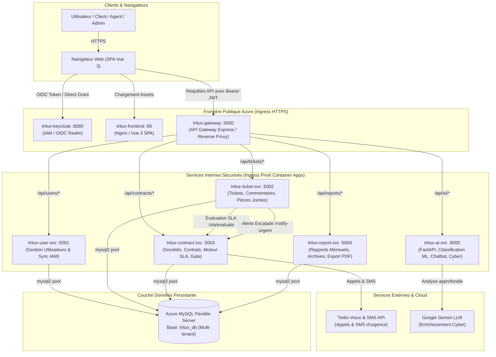
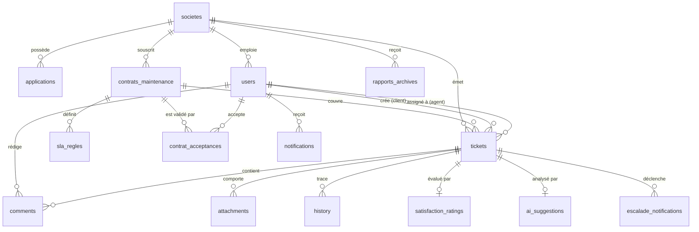

# Architecture Globale du Système — Tritux Helpdesk SaaS B2B

---

## 1. Vue d'Ensemble & Vision Métier

**Tritux Helpdesk** est une plateforme SaaS B2B de gestion de support et de billetterie informatique (IT Ticketing), conçue selon les normes de l'industrie pour répondre aux besoins d'infogérance et de maintenance multi-entreprises avec engagement de niveau de service (**SLA — Service Level Agreement**).

### Objectifs Clés
- **Isolation Multi-Tenant B2B** : Gestion étanche de plusieurs sociétés clientes (`Acme`, `Orange`, etc.) avec leurs applications métiers dédiées.
- **Gouvernance des Contrats & SLA** : Conditionnement strict de l'accès aux services au statut du contrat de maintenance (types `24/7`, `5/7`, `8/5`) et calcul automatique des deadlines d'intervention.
- **Escalade d'Urgence 24/7 & Téléphonie** : Système d'alerte en cascade à 3 paliers déclenchant des notifications temps réel, SMS et appels vocaux automatisés via **Twilio**.
- **Assistance Intelligente & Cyber** : Pipeline IA pour la classification automatique des tickets, suggestions de résolution et détection des menaces de sécurité.
- **Identité Unifiée (IAM)** : Authentification robuste déléguée à **Keycloak** (OIDC / OAuth2 / PKCE).
- **Déploiement Cloud Moderne** : Architecture conteneurisée déployée en production sur **Azure Container Apps** avec base de données managée **Azure Database for MySQL Flexible Server**.

---

## 2. Diagramme d'Architecture Globale

Le schéma suivant illustre l'organisation des microservices, les flux réseaux et les frontières de sécurité :

---

## 3. Topologie des Composants & Microservices

| Service | Technologie | Rôle Principal | Exposition Réseau | Port |
|---|---|---|---|---|
| **Frontend** | Vue 3, TypeScript, Pinia, Tailwind, Vite | Interface utilisateur moderne (SPA responsive) pour clients, agents IT et super administrateurs | Publique (HTTPS FQDN Azure) | 80 |
| **API Gateway** | Node.js, Express, `http-proxy-middleware` | Point d'entrée unique de l'API, routage, CORS, aggregation, logging | Publique (HTTPS FQDN Azure) | 5000 |
| **Keycloak IAM** | Keycloak 24, Quarkus, OpenID Connect | Gestionnaire d'identité et d'accès (IAM), gestion des utilisateurs, rôles, sessions, Direct Grants | Publique (HTTPS FQDN Azure) | 8080 |
| **User Service** | Node.js, Express, `mysql2` | Gestion des comptes utilisateurs, profils, synchronisation automatique depuis Keycloak (`/auth/keycloak-sync`) | Privée (Réseau interne Azure) | 5001 |
| **Ticket Service** | Node.js, Express, `mysql2` | Cycle de vie des tickets (création, transition d'état, assignation par spécialité, commentaires internes/publics, satisfaction) | Privée (Réseau interne Azure) | 5002 |
| **Contract Service** | Node.js, Express, `mysql2`, Twilio SDK | Moteur de calcul SLA, gestion des sociétés et contrats (24/7, 5/7, 8/5), gate d'accès, escalade d'urgence | Privée (Réseau interne Azure) | 5003 |
| **Report Service** | Node.js, Express, `mysql2` | Agrégation des métriques SLA (taux de respect, MTTR, volume par statut/urgence), génération et archivage | Privée (Réseau interne Azure) | 5004 |
| **AI Service** | Python 3.11, FastAPI, NumPy | Moteur de Machine Learning (TF-IDF + Naive Bayes), chatbot guidé, module de détection des cybermenaces | Privée (Réseau interne Azure) | 8000 |
| **Base de données** | Azure Database for MySQL Flexible Server | Stockage relationnel persistant, schéma multi-tenant avec clés étrangères et contraintes d'intégrité | Privée / Sécurisée par IP & SSL | 3306 |

---

## 4. Modèle de Données & Isolation Multi-Tenant

L'architecture de données repose sur un modèle relationnel hautement normalisé, garantissant la séparation étanche des données par société cliente (`societe_id`).

### Description des Entités Clés

1. **`societes`** : Représente l'organisation cliente tierce (ex: Acme Tunisie, Orange).
2. **`applications`** : Logiciels ou infrastructures sous contrat pour chaque société (ERP, Portail Web, E-Shop).
3. **`contrats_maintenance`** : Règle régissant le support :
   - `type_contrat` : `24/7` (critique), `5/7` (lundi-vendredi 8h-18h), `8/5`.
   - `canal_notification_urgence` : Canal préférentiel (`email`, `sms`, `call`).
   - `heures_ouvrees` & `jours_ouvres` : Plage de calcul pour le gel du temps SLA.
4. **`sla_regles`** : Grille d'objectifs de temps de réponse par niveau d'urgence (`urgent`, `high`, `medium`, `low`).
5. **`tickets`** : Entité centrale enregistrant le snapshot SLA (`sla_deadline`, `sla_deferred`, `sla_resume_at`).
6. **`contrat_acceptances`** : Audit trail légal traçant l'acceptation des conditions contractuelles par l'utilisateur à chaque session.
7. **`escalade_notifications`** : Historique des alertes émises aux différents paliers (horodatage, destinataire, canal, statut d'envoi).

---

## 5. Rôles et Matrice de Sécurité (RBAC)

L'application implémente un contrôle d'accès basé sur les rôles (**Role-Based Access Control**) synchronisé entre Keycloak et la base de données :

| Rôle Métier | Code Realm Keycloak | Code Interne Backend | Périmètre des Données & Privilèges |
|---|---|---|---|
| **Super Admin** | `super-admin` | `SUPER_ADMIN` | Vision globale 360°, configuration de toutes les sociétés, contrats, agents IT et statistiques globales. |
| **Agent IT** | `agent-it` | `AGENT_IT` | Traitement des tickets assignés ou non assignés urgents, escalade technique, ajout de commentaires internes, visualisation des spécialités. |
| **Admin Client** | `client-admin` | `CLIENT_ADMIN` | Gestion des tickets de toute sa société, consultation du contrat de maintenance de sa société, rapports SLA de l'entreprise. |
| **Utilisateur Client** | `client-user` | `CLIENT_USER` | Création et suivi de ses propres tickets, interaction avec le chatbot IA, auto-assistance, consultation du contrat. |

---

## 6. Stratégie de Résilience & Haute Disponibilité sur Azure

1. **Auto-healing & Scalabilité** : Azure Container Apps gère automatiquement le cycle de vie des conteneurs via KEDA et Kubernetes sous-jacent. En cas de défaillance, un replica sain est automatiquement instancié.
2. **Double Vérification JWT (Zero Trust)** :
   - Décodage et validation cryptographique asynchrone des tokens Keycloak RS256 via le jeu de clés publiques JWKS (`/certs`).
   - Mécanisme de fallback JWT HS256 local permettant la résilience en environnement de test ou de démo hors-ligne.
3. **Fail-Closed Security Gate** : Si le service de contrat est injoignable ou si l'utilisateur n'a pas de contrat valide, l'accès au tableau de bord des tickets est verrouillé par défaut, interdisant toute utilisation non couverte contractuellement.
