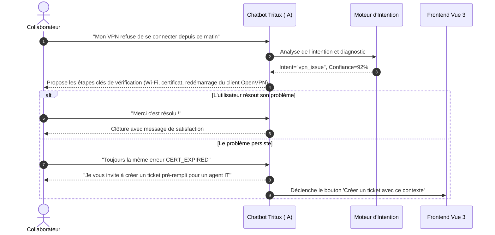

# Module d'Intelligence Artificielle — Tritux AI Service

---

## 1. Vue d'Ensemble & Stratégie d'IA Hybride

Le service d'Intelligence Artificielle de **Tritux Helpdesk** (`ai-service`) adopte une approche **hybride à trois niveaux** combinant Machine Learning supervisé classique, moteur de règles expert et modèles de langage génératifs (LLM) :

```
                                  Requête Utilisateur / Incident
                                                |
                                                v
                    +-------------------------------------------------------+
                    |           Pipeline de Prétraitement NLP               |
                    | Normalisation NFKC, minuscules, suppression regex     |
                    +-------------------------------------------------------+
                                                |
        +---------------------------------------+---------------------------------------+
        |                                       |                                       |
        v                                       v                                       v
+-----------------------+           +-----------------------+           +-----------------------+
|    NIVEAU 1 : ML      |           |  NIVEAU 2 : CHATBOT   |           |    NIVEAU 3 : SOC     |
|   CLASSIFICATION      |           |    AUTO-ASSISTANCE    |           |     ANALYSE CYBER     |
| • TF-IDF Vectorizer   |           | • 12 Scénarios Guidés |           | • Moteur Détection    |
| • Naive Bayes custom  |           | • Intent Matching     |           | • Risk Score (0-100)  |
| • Catégorie & Priorité|           | • Diagnostic pas-à-pas|           | • Confinement Immédiat|
| • Confiance (0-100%)  |           | • Résolution autonome |           | • Enrichissement LLM  |
+-----------------------+           +-----------------------+           +-----------------------+
        |                                       |                                       |
        +---------------------------------------+---------------------------------------+
                                                |
                                                v
                        Réponse Structurée JSON & Suggestions UI
```

### Avantages de cette Architecture Hybride :
1. **Zéro Latence & Haute Disponibilité** : Le modèle de Machine Learning local répond en moins de **15 millisecondes**, sans dépendre d'une API externe ou d'une clé payante pour classifier les tickets.
2. **Confidentialité des Données Métiers** : La catégorisation et les suggestions immédiates sont calculées localement dans le conteneur sécurisé sans fuite de données vers l'extérieur.
3. **Puissance Générative Ponctuelle** : Le LLM (Google Gemini / OpenAI) n'est sollicité qu'en complément pour des cas complexes ou l'analyse cyber approfondie.

---

## 2. Niveau 1 : Moteur de Machine Learning (Classification des Tickets)

### Algorithme & Modélisation Mathématique
- **Vectorisation Textuelle** : **TF-IDF (Term Frequency - Inverse Document Frequency)** :
  $$\text{TF-IDF}(t, d, D) = \text{TF}(t, d) \times \log\left(\frac{|D|}{1 + |\{d \in D : t \in d\}|}\right)$$
  Permet d'attribuer un poids élevé aux termes discriminants du support IT (`chiffrement`, `vpn`, `blue screen`, `phishing`) tout en atténuant les mots communs.
- **Classifieur** : **Multinomial Naive Bayes (MNB)** avec lissage de Laplace ($\alpha = 1.0$) :
  $$P(C_k \mid x) \propto P(C_k) \prod_{i=1}^{n} P(x_i \mid C_k)$$
  Implémenté sur mesure en Python natif (`tritux_ml.py`) pour une portabilité maximale, une empreinte mémoire plume (< 50 Mo) et une absence totale de dépendances lourdes sous conteneur Alpine.

### Classes Cibles Prédites
- **Catégories Métiers** :
  1. `network` (Réseau, Wi-Fi, VPN, pare-feu, DNS)
  2. `security` (Phishing, virus, ransomware, usurpation)
  3. `software` (Bugs applicatifs, ERP, crash, licences)
  4. `hardware` (Écrans, imprimantes, serveurs, disques durs)
  5. `account` (Mots de passe, comptes verrouillés, MFA, SSO)
  6. `email` (Outlook, messagerie, boîte saturée, spams)
  7. `other` (Demandes génériques)
- **Priorités Prédites** : `urgent`, `high`, `medium`, `low`.

### Pipeline d'Entraînement des Données
1. **Génération & Collecte (`scripts/generate_dataset.py`)** : Dataset de 442 tickets rédigés en français, représentatifs du support IT d'entreprise avec variations lexicales et fautes courantes.
2. **Nettoyage & Normalisation (`scripts/clean_data.py`)** :
   - Normalisation Unicode (NFKC), passage en minuscules.
   - Suppression des URLs, adresses e-mail, chiffres et ponctuations non signifiantes.
   - Filtrage des *stop-words* français.
3. **Entraînement & Sérialisation (`scripts/train_model.py`)** :
   - Sauvegarde des artefacts optimisés sous format binaire (`models/category_model.pkl`, `models/priority_model.pkl`).
   - Génération automatique du rapport de performance (`models/metrics.json`).

---

## 3. Niveau 2 : Chatbot d'Auto-Assistance & Résolution Autonome

Le chatbot IT interactif (accessible via le bouton flottant sur le frontend) guide les collaborateurs pas à pas pour tenter de résoudre leur incident avant même d'ouvrir un ticket, désengorgeant ainsi le support de niveau 1.

### Base de Connaissances Experte (`data/knowledge_base.json`)
Comprend 12 scénarios d'incidents fréquents en entreprise :
- Problème de connexion VPN Tritux / Client
- Réinitialisation et déverrouillage de mot de passe SSO
- Tentative suspecte de phishing reçue par e-mail
- Problème de synchronisation de la messagerie Outlook
- Écran bleu (BSOD) et redémarrages inopinés
- Problème de certificat ou accès refusé à l'ERP
- Imprimante réseau non détectée
- Authentification Multi-Facteurs (MFA) révoquée ou nouveau smartphone

### Arbre de Résolution Guidée


---

## 4. Niveau 3 : Moteur d'Analyse Cyber & Détection de Menaces (`cyber_engine.py`)

Ce module fait office de premier rempart de sécurité (SOC léger) pour analyser les courriels suspects, URL malveillantes ou signaux de compromission.

### Types de Menaces Détectées
| Type de Menace | Libellé | Score de Risque | Priorité Associée | Actions Recommandées |
|---|---|---|---|---|
| `ransomware` | Rançonlogiciel / Chiffrement | **95 / 100** | **Urgent (Immédiat)** | Déconnexion immédiate du réseau (Wi-Fi/câble), alerte du RSSI, ne pas éteindre le PC. |
| `phishing` | Tentative d'Hameçonnage | **88 / 100** | **Urgent** | Ne pas cliquer, ne saisir aucun identifiant, transférer l'en-tête technique au support. |
| `credential_theft` | Vol d'Identifiants | **82 / 100** | **Urgent** | Réinitialisation immédiate du mot de passe, révocation des sessions actives, vérification MFA. |
| `malware` | Logiciel Malveillant / Antivirus | **75 / 100** | **High** | Scan complet avec l'EDR de l'entreprise, isolation de la machine hôte. |
| `suspicious_link` | URL / Domaine Suspect | **65 / 100** | **Medium** | Blocage au niveau du proxy/DNS d'entreprise, analyse en Sandbox. |

### Calcul du Score de Risque & Déclenchement Automatique
- **Algorithme Heuristique** : Pondération par motifs d'ingénierie sociale (mots d'urgence, menaces de suspension de compte, demandes de coordonnées bancaires, domaines de rebond).
- **Règles de Confinement** : Tout score de risque $\ge 70$ pré-remplit un ticket de priorité **Urgente** dans la catégorie **Sécurité**, déclenchant instantanément le moteur SLA critique.

---

## 5. Spécification des Endpoints de l'API IA

### 1. `POST /analyze` — Analyse en Direct d'un Ticket
- **Entrée** : `title`, `description`.
- **Sortie** :
  ```json
  {
    "category": "network",
    "priority": "urgent",
    "confidence": 91,
    "suggestedResponse": "Bonjour, d'après l'analyse IA ce ticket relève du réseau...",
    "model": "tfidf_nb_custom",
    "canSelfResolve": true,
    "selfHelpSteps": [
      "Vérifiez que votre connexion Internet filaire ou Wi-Fi est stable.",
      "Redémarrez le client VPN Tritux.",
      "Vérifiez que vos identifiants réseau n'ont pas expiré."
    ],
    "matchedIntent": "vpn_failure"
  }
  ```

### 2. `POST /chat` — Interaction Conversationnelle
- **Entrée** : `message`, `history` (tableau des échanges précédents).
- **Sortie** : `reply`, `canSelfResolve`, `steps`, `suggestTicket`, `category`, `priority`.

### 3. `POST /cyber/analyze` — Analyse Cyber Dédiée
- **Entrée** : `content` (corps d'e-mail ou message suspect, jusqu'à 8 000 caractères).
- **Sortie** : `riskLevel` (critical/high/medium/low), `riskScore` (0-100), `threatType`, `indicators`, `immediateActions`.

### 4. `GET /health` & `GET /model/info` — État & Métriques
- Fournit l'état opérationnel du modèle (`modelReady: true`), le nombre d'entrées en base de connaissances et les métriques d'exactitude calculées lors de l'entraînement.
