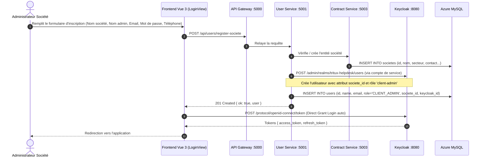
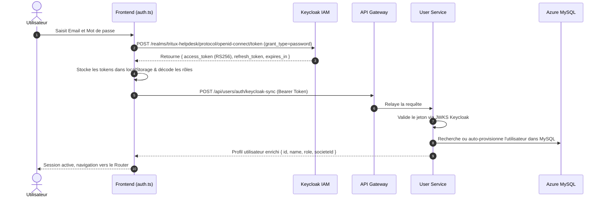
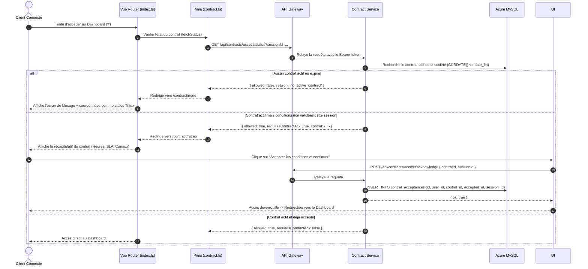
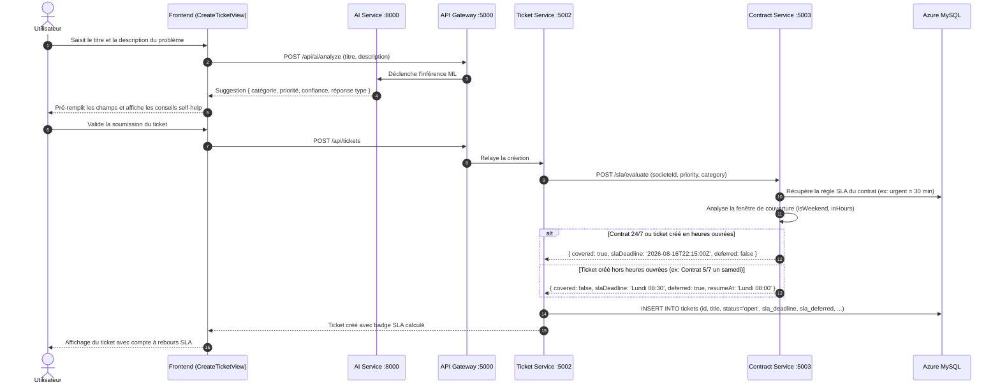
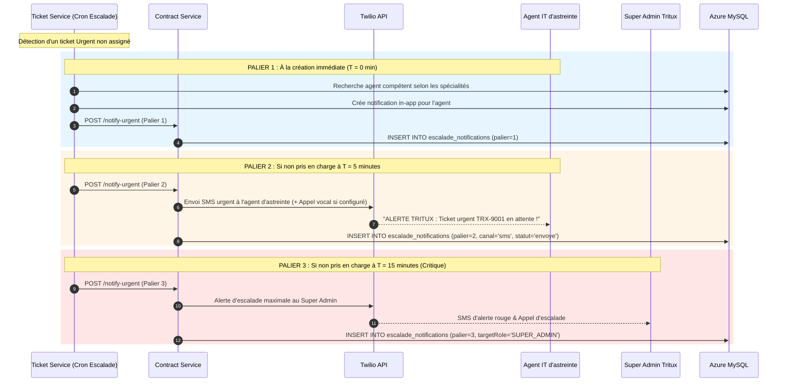

# Workflows Fonctionnels & Techniques — Tritux Helpdesk

---

## 1. Workflow 1 : Inscription B2B d'une Société & Provisioning IAM

Ce flux permet l'enregistrement autonome d'une nouvelle entreprise cliente, la création de son entité légale en base et la création sécurisée de son compte administrateur dans Keycloak.

---

## 2. Workflow 2 : Authentification & Synchronisation IAM

Ce flux décrit la séquence de connexion unifiée avec Direct Access Grant, validation du jeton asymétrique RS256 et réconciliation automatique des identités locales.

---

## 3. Workflow 3 : Gate d'Accès au Contrat de Maintenance (Contract Gate)

Ce mécanisme de sécurité empêche tout accès au support pour les sociétés n'ayant pas souscrit de contrat de maintenance actif, et impose l'acceptation formelle des conditions de service à chaque session.

---

## 4. Workflow 4 : Cycle de Vie d'un Ticket & Moteur de Calcul SLA

Ce flux montre la création d'un ticket, sa catégorisation par l'IA, le calcul de la deadline SLA en fonction du calendrier contractuel (24/7 vs heures ouvrées 5/7) et la prise en compte du report de délai.

---

## 5. Workflow 5 : Escalade d'Urgence à 3 Paliers & Alerting 24/7 (Twilio)

Pour les tickets critiques non pris en charge à temps, un mécanisme d'escalade en cascade prévient les équipes d'astreinte selon trois paliers temporels stricts :

---

## 6. Workflow 6 : Traitement du Ticket par l'Agent & Satisfaction Client

1. **Prise en charge** : L'agent IT clique sur *"Prendre en charge"*, le statut passe à `inprogress`, l'agent est assigné et l'escalade d'urgence s'interrompt automatiquement.
2. **Échanges** :
   - **Commentaires publics** : Visibles par le client avec notification instantanée.
   - **Notes internes** : Réservées au staff IT (badge jaune "Interne"), masquées aux clients.
3. **Résolution** : L'agent documente la solution et bascule le statut à `resolved`. Le chronomètre SLA s'arrête.
4. **Évaluation Client** : Le client reçoit une invite pour noter la prestation (1 à 5 étoiles) avec commentaire libre. La note est enregistrée dans `satisfaction_ratings`.

---

## 7. Workflow 7 : Audit & Rapports de Conformité SLA

1. **Agrégation des Métriques** (`report-service`) :
   - Nombre total de tickets sur la période (mois, trimestre).
   - Taux de respect des engagements SLA ($\% = \frac{\text{Tickets respectés}}{\text{Tickets résolus}} \times 100$).
   - **MTTR (Mean Time To Resolve)** : Durée moyenne de résolution en heures.
   - Distribution par catégorie (`network`, `security`, etc.) et par priorité.
2. **Archivage & Génération** :
   - Génération d'une synthèse JSON stockée dans `rapports_archives`.
   - Export prêt à l'impression / PDF pour les comités de pilotage avec les directions clientes.
